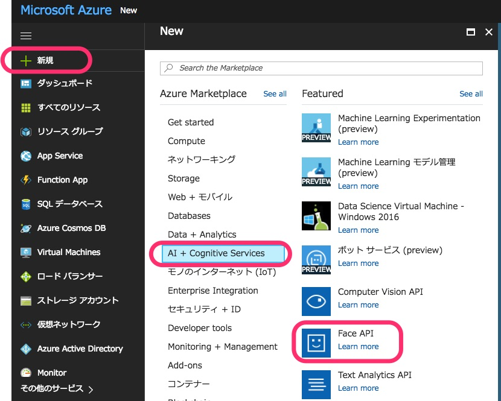
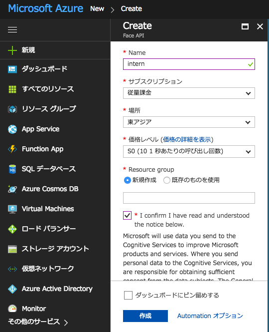
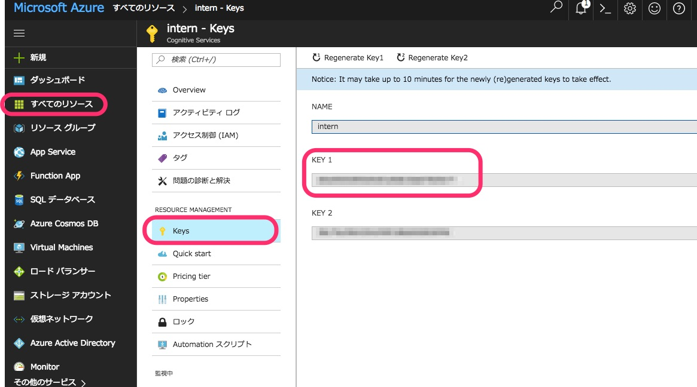

# 事前準備(TensorFlow CNN)
Python3.xとTensorFlowが動作する開発環境を、Dockerイメージとして用意しました。
当日までに、以下の手順で開発環境を構築しておいてください。

* **必須** ディスク空き容量
   * 5GB以上

## Dockerインストール
* Dockerのインストール手順はmacOSとWindowsで異なります

### macOS
* インストール
   * 下記リンクから、Stable Channelのインストーラーをダウンロードして実行。
   * https://docs.docker.com/docker-for-mac/install/
* Docker動作確認
   * `Docker.app` を起動し、続けて `Terminal.app` を起動。
   * `Terminal.app` で `docker` コマンドを入力し、Dockerの使用法が表示されることを確認。

### Windows
* 下記リンクから、Docker Toolboxをダウンロードして実行。
   * https://www.docker.com/products/docker-toolbox
* `Docker Quicstart Terminal` が起動することを確認。


## 動作確認

### 1. Dockerイメージをダウンロード
* **macOS** の場合は `Terminal.app` 、 **Windows** の場合は `Docker Quicstart Terminal` をそれぞれ起動し、下記コマンドを実行。

```.sh
# https://hub.docker.com/r/knagadou/ub-tensorflow/ からDockerイメージをダウンロード
$ docker pull knagadou/ub-tensorflow
```

### 2. コンテナを起動

```.sh
# ダウンロードしたDockerイメージからコンテナを起動
$ docker run -it knagadou/ub-tensorflow
```

### 3. チュートリアル[CIFAR-10](http://www.cs.toronto.edu/~kriz/cifar.html)を分類してみる
* このチュートリアルでは、「CIFAR-10」というデータセットを畳み込みニューラルネットワーク（CNN）で分類します。
* 学習が進めば進むほど、画像の分類精度が上がっていきます。
* 20,000ステップ学習するとプログラムが終了します。
   * 20,000ステップ実行するまでかなりの時間を要するため、途中で止めてしまっても大丈夫です。
   * `Ctl` + `C` でプログラムを止められます。

```.sh
$ cd /opt/tensorflow/tensorflow_cookbook/08_Convolutional_Neural_Networks/03_CNN_CIFAR10
$ python 03_cnn_cifar10.py

# 実行すると、以下のように学習が始まる
# 2017-10-06 06:00:35.239803: W tensorflow/core/platform/cpu_feature_guard.cc:45] The TensorFlow library wasn't compiled to use SSE4.1 instructions, but these are available on your machine and could speed up CPU computations.
# 2017-10-06 06:00:35.246938: W tensorflow/core/platform/cpu_feature_guard.cc:45] The TensorFlow library wasn't compiled to use SSE4.2 instructions, but these are available on your machine and could speed up CPU computations.
# 2017-10-06 06:00:35.248533: W tensorflow/core/platform/cpu_feature_guard.cc:45] The TensorFlow library wasn't compiled to use AVX instructions, but these are available on your machine and could speed up CPU computations.
# Getting/Transforming Data.
# Creating the CIFAR10 Model.
# Declare Loss Function.
# Creating the Training Operation.
# Initializing the Variables.
# Starting Training
# Generation 50: Loss = 2.01061
# Generation 100: Loss = 1.77213
# Generation 150: Loss = 1.61843
# Generation 200: Loss = 1.79377
# Generation 250: Loss = 1.62610
# Generation 300: Loss = 1.60942
# Generation 350: Loss = 1.54522
# Generation 400: Loss = 1.39279
# Generation 450: Loss = 1.51283
# Generation 500: Loss = 1.59041
#  --- Test Accuracy = 39.84%.
```

## 参考情報
* [TensorFlowチュートリアル](https://www.tensorflow.org/tutorials/)にCNNの説明があります。
   * https://www.tensorflow.org/tutorials/deep_cnn

<br><br>

# 事前準備(Azure Face API)

### 1. Azure アカウント作成
下記からアカウント(１ヶ月無料)を作成します  
https://azure.microsoft.com/ja-jp/free/

### 2. Azure Face API
Face API を使う準備をします。

<!--  -->


<!--  -->


- Name : 適当 (ここでは intern)
- サブスクリプション : 無料 を選択
- 場所 : 東アジア
- 価格レベル : F0 (画面上ではS0になっていますが、F0 が無料枠です)
- Resource group : 適当 (ここでは intern)

<!--  -->


作成が完了したら、キー1 を確認します。

### 3. Face API テスト
[事前準備(TensorFlow CNN)](#事前準備tensorflow-cnn)で用意したDocker環境で、Face APIを利用出来るかテストします。

* Dockerコンテナを起動

```
$ docker run -it knagadou/ub-tensorflow
```

* 以下の写真を「sample.jpg」として保存


```
$ wget https://s3-ap-northeast-1.amazonaws.com/jp.co.dreamarts.event20171028/image/sample.jpg
$ mv 31304143-79f7c786-ab56-11e7-919e-986384ec6ffb.jpg sample.jpg
```

* Pythonプログラムを用意
   - requests モジュール を使用します。  予め pip を使ってインストールしておきます。(※万が一、pip コマンドが無い場合は、 [Qiita](https://qiita.com/suzuki_y/items/3261ffa9b67410803443)等を参照してインストールしてください。)

```.sh
$ pip install requests
```

* 以下のPythonプログラムを`detect.py`として保存
   - 8 行目`<ここはあなたのサブスクリプションキー>` 部分は、[2. Azure Face API](#2-azure-face-api) で取得したキーを記載します。(※当日は、弊社でサブスクリプションキーを用意する予定です。)

```.py
import sys
import requests

url = 'https://eastasia.api.cognitive.microsoft.com/face/v1.0/detect';

headers = {
    'Content-Type': 'application/octet-stream',
    'Ocp-Apim-Subscription-Key': '<ここはあなたのサブスクリプションキー>',
}
params = {
    'returnFaceId': 'true',
    'returnFaceLandmarks': 'false',
    'returnFaceAttributes': 'age,gender',
}
if __name__ == '__main__':
    argv = sys.argv
    if len(argv) == 1:
        quit()
    r = requests.post(url ,headers = headers,params = params,data = open(argv[1],'rb'))

    print(r.text)
```

* 以下のコマンドを実行

```.sh
$ python detect.py sample.jpg

# 以下の結果が出力されれば成功です
[{"faceId":"25eb03fd-fd08-4c7c-9cc2-5563f3cda6a2","faceRectangle":{"top":84,"left":31,"width":97,"height":97},"faceAttributes":{"gender":"female","age":52.4}}]
```

## 参考情報
* 上記は detect API を使用しました。API ドキュメント は下記にあります。
   - https://westus.dev.cognitive.microsoft.com/docs/services/563879b61984550e40cbbe8d/
* 当日はさらに identify API を使って、個人の判定を行う予定です。
